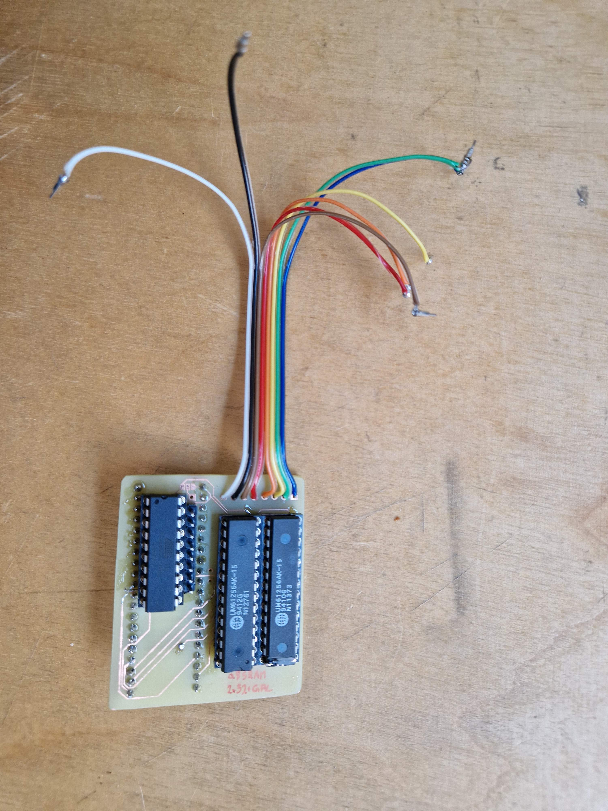
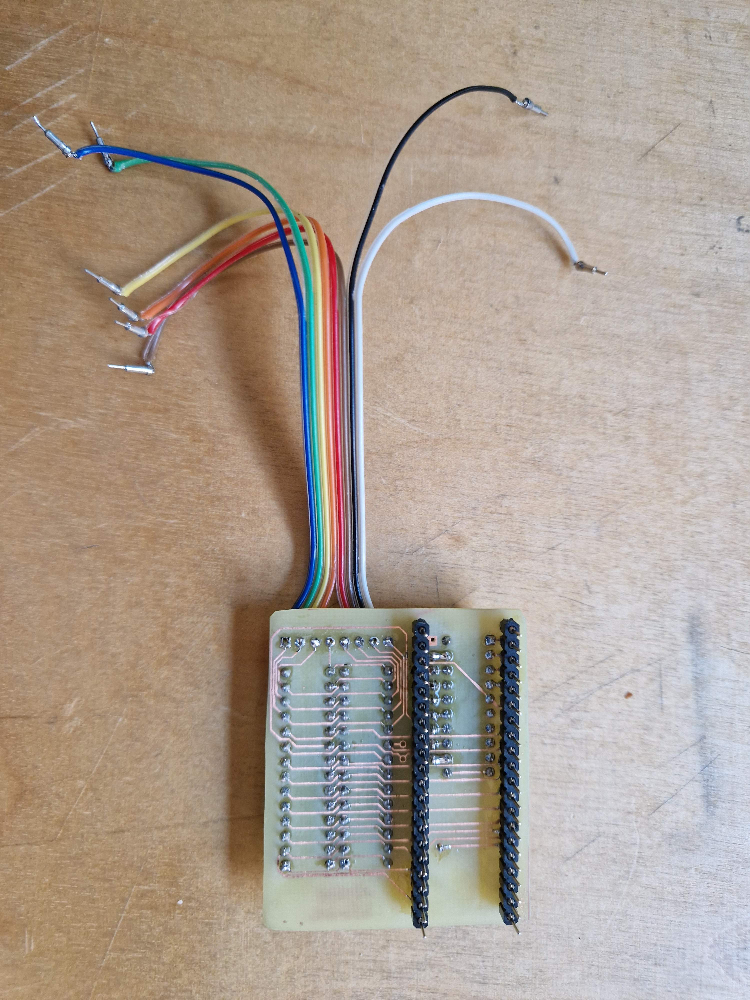

Atari 8bit Freddy and DRAM chips replacement.
---------------------------------------------

I created it because I had 32k SRAM chips available and needed to test if my Freddy was working (it was).
The board is intended for home manufacturing. There is only 1 via. I was able to do it using 3d printer with drill attachment and laser printer thermo-transfer. Make sure to solder on both sides where necessary or tell me how to make vias/holes conductive at home.

There are more reasonable Freddy and SRAM replacements avialble:

Pre-built:
- https://retrolemon.co.uk/atari-8bit-upgrades/81-freddie-module.html
- https://lotharek.pl/productdetail.php?id=233
- https://retrolemon.co.uk/atari-8bit-upgrades/114-sram-64kb.html
- https://lotharek.pl/productdetail.php?id=291

Schematics:
- https://github.com/prcoder-1/a8-sram64kb
  
What's left from Freddy is then just frequency /4 divider you can do on 7474.

Finished thing:

